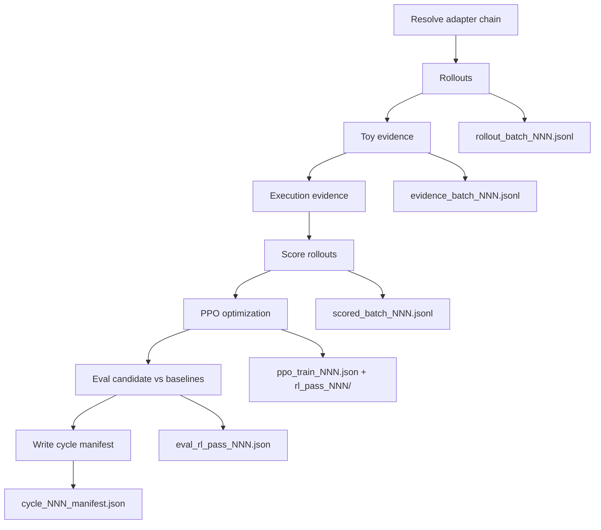

# economistRL Adapter Experiment

`economistRL` is a new experimental LoRA adapter lane for testing whether reward-scored RL improves economy mechanics that previous specialists handled poorly. It is intentionally separate from `economy_tooltip` / `resource_ui_projection`, which is mostly an economy UI/copy specialist.

## Scope

Curriculum target: **500 prompts total** with a **70% / 30% split**:

- **350 economy prompts** across economy subsections
- **150 generalist prompts** for common RL/framework skills

Economy subsections:

- `economy_simulation`
- `market_dynamics`
- `population_dynamics`
- `food_economy`
- `labor_economy`
- `progressive_costs`
- `feedback_control`
- `resource_projection`

Generalist subsections:

- `instruction_following`
- `structured_reasoning`
- `code_patch_planning`
- `test_design_and_invariants`
- `debugging_and_root_cause`
- `concise_explanation`
- `safety_and_scope_control`

Initial task bank: `benchmarks/economistRL_tasks_v1.json` (plan-style references; legacy).

**Coding task bank:** `benchmarks/economistRL_tasks_v2_coding.json` (format conversion from v1).

**Execution-tagged bank (default for cycles):** `benchmarks/economistRL_tasks_v3_execution.json` — per-task `execution_mode` (`integration` with `integration_kind: sandbox|standard`, or `arena` when linked), `starter_paths` / `starter_files`, BM25 `context_paths`, and `verify_commands` (per-task `vitest` for sandbox, `test:ml-cohort` for standard/arena).

**Sandbox vitest environments:** fictional mechanics are implemented under `src/lib/economistRl/<task_slug>/mechanic.ts` with shared helpers in `src/lib/economistRl/envs/<subsection>/` (`types.ts`, `runTicks.ts`). Starters and prompts are generated by `scripts/economist_rl_sandbox_envs.py` (subsection-aware stubs/tests; no `src/lib/economy.ts` in sandbox prompts). **Field names** are aligned to Fallen Empire vocabulary (`storageFood` ↔ `City.storage.food`, `playerGold`, `POP_BIRTH_RATE`, …) via `scripts/economist_rl_field_names.py`; see `docs/SANDBOX_GAME_FIELD_ALIGNMENT.md`. Legacy task-bank keys (`foodStock`, `currentStock`, …) normalize at scenario read time. `runTicks` clones state each tick (`state = fn({ ...state })`); vitest templates require **trace deltas** (`trace[N].field not.toBe(trace[0].field)`) and cross-seed ordering where applicable (fixes static-seed false passes). Retag (refresh frozen starters in-place):

```bash
ECONOMIST_RL_SOURCE_REPO=~/fallen-empire \\
  python scripts/adapters/tag_economist_rl_task_execution.py \\
  --in benchmarks/economistRL_tasks_v3_execution.json \\
  --out benchmarks/economistRL_tasks_v3_execution.json \\
  --refresh-all
```

Generate (initial tag from v2):

```bash
python scripts/adapters/convert_economist_rl_tasks_to_coding.py
ECONOMIST_RL_SOURCE_REPO=/path/to/fallen-empire python scripts/adapters/tag_economist_rl_task_execution.py
python scripts/economist_rl_reward_engine.py validate --tasks benchmarks/economistRL_tasks_v3_execution.json
```

**Eval manifest:** `benchmarks/economistRL_eval_manifest_v1.json` — stratified eval (arena gold + sandbox economy + generalist); used by `run_economist_rl_lambda_cycle.py --eval-manifest`.

**Rollout defaults:** `--max-tokens 4000`, BM25 context pack from `ECONOMIST_RL_SOURCE_REPO` when set, sandbox starters materialized in the execution worktree before apply.

After converting, rebuild seed SFT so the adapter learns fenced patches (not plan prose):

```bash
python scripts/adapters/build_economist_rl_dataset.py
# then mlx_lm.lora per training/economistRL_lora_qwen25_coder_7b.yaml
```

Scoring/tooling: `scripts/economist_rl_reward_engine.py`

Seed bootstrap builder: `scripts/adapters/build_economist_rl_dataset.py`

Training config: `training/economistRL_lora_qwen25_coder_7b.yaml` (writes `checkpoints/adapters/economistRL/seed_bootstrap`)

Registry entry: `training/adapter_registry_v1.json` (`adapter_id: economistRL`, `promotion_state: experimental`)

## Task Format

Each task contains:

- `id`, `title`, `difficulty`, `subskill`, and `rl_focus`
- `curriculum_track`: `economy` or `generalist`
- `prompt`
- `simulation_spec`: a focused 20-tick behavior scenario with scored goals
- `targeted_tests`: executable outcome expectations; tests should verify behavior, not exact names
- `static_code_mechanics`: flexible hooks/signals for state fields, tick integration, bounded updates, cache invalidation, etc.
- `formula_signal`: formula/curve/bounds patterns that indicate real computation
- `instruction_contract`: policy gates for unnecessary/broad changes and test weakening
- `progress_guard`: compares `previous_potential` and `new_potential` without treating no-progress patches as malicious
- `anti_overfit_guards`: reward-gaming caps for hardcoding, deleting tests, bypassing mechanics, unrelated changes, or non-general behavior
- `expect.all_contains`, `expect.any_contains`, `expect.none_contains`
- `expect.min_chars` / `expect.max_chars`
- `expect.mechanics`, where each mechanic has a `name` and keyword set
- optional `reference_answer` for seed bootstrap rows

Add a task:

```bash
python scripts/economist_rl_reward_engine.py add-task \
  --id economistRL-new-task-07 \
  --title "New Economy Mechanic" \
  --subskill market_inventory_pressure \
  --difficulty hard \
  --curriculum-track economy \
  --focus-tag economy_simulation \
  --focus-tag market_dynamics \
  --required price \
  --required stock \
  --optional elasticity \
  --mechanic stock_pressure:stock,scarcity,surplus \
  --prompt "Describe the mechanic and its invariant."
```

Validate:

```bash
python scripts/economist_rl_reward_engine.py validate
```

Validation reports current track counts and remaining tasks needed for the 350 economy / 150 generalist target.

Current task distribution:

- `food_population_feedback`: `60`
- `market_elasticity_pricing`: `60`
- `labor_wage_productivity`: `55`
- `inventory_storage_spoilage`: `50`
- `upkeep_progressive_costs`: `50`
- `resource_projection_cache_integrity`: `50`
- `adversarial_multidomain_economy`: `25`
- `instruction_following`: `25`
- `structured_reasoning`: `25`
- `code_patch_planning`: `25`
- `test_design_and_invariants`: `25`
- `debugging_and_root_cause`: `20`
- `concise_explanation`: `15`
- `safety_and_scope_control`: `15`

## Scoring

**RL trains on continuous `reward` (0–1).** PPO uses `score.reward` only — not `failures[]`, not `strict_scorecard_pass` / `high_reward`. Each scored row also includes:

- `training_usable`: row has output and can enter PPO batch building
- `hard_cap_applied` / `cap_reason`: true only for real compile failure, policy caps, or reward-gaming caps
- `diagnostics`: non-reward diagnostic tags (legacy rubric, partial static/formula hints)
- `strict_scorecard_pass` (alias `high_reward`): strict eval threshold for scorecard summaries only

Optional scorecard summaries report `strict_scorecard_pass_rate` (formerly `high_reward_rate`). Cycle eval writes comparative telemetry only; `**training/adapter_registry_v1.json` is never auto-updated** by the RL runner.

Each cycle eval JSON includes two comparisons for the candidate (`rl_pass_NNN`):


| Comparison             | Baseline                                                              | Meaning                                                       |
| ---------------------- | --------------------------------------------------------------------- | ------------------------------------------------------------- |
| `vs_registry_baseline` | Registry adapter (`seed_bootstrap`)                                   | Long-horizon reference vs accepted bootstrap                  |
| `vs_working_source`    | Effective rollout/PPO source (`rl_pass_{N-1}` or registry on cycle 1) | Did this PPO step help vs the policy that generated rollouts? |


When cycle 1 uses the registry adapter for rollouts, both baselines are the same path and the runner reuses one baseline eval.

`score` expects JSONL rows with `task_id` and one generated text field: `output`, `assistant`, `response`, `generated_text`, or `text`.

```bash
python scripts/economist_rl_reward_engine.py score \
  --outputs-jsonl benchmarks/results/economistRL_rollouts.jsonl
```

Reward components:

- `targeted_tests` (`55%`): Vitest on applied `mechanic.ts` after execution evidence. Each `simulation_spec.goals[]` entry is one `it('goal_*')` in the generated test file; JSON report scoring uses **goal weights** (`scripts/economist_rl_vitest_goals.py`, `merge_outcome_checks_with_vitest`).
- **Rollouts are mechanic-only:** prompts forbid `tests/` fences; apply uses `apply_allowed_paths` (no `tests/`**). Vitest files are materialized from `sandbox_starter_bodies()` (live goal tests), not model output.
- Text/toy `simulation_results` and `runAppliedSimCli` are **not** used for training reward (behavior is graded only via Vitest).
- Re-score a saved batch without re-generating: `python scripts/rescore_economist_rl_rollouts.py --rollout-file … --cycle-id N --execution-source-repo …`.
- **Step-1 oracle gate** (reference mechanic + Vitest before PPO): `python scripts/oracle_reference_sanity.py --limit 3 --execution-source-repo $ECONOMIST_RL_SOURCE_REPO` — expects all tasks `compiled` and `targeted_tests` component ≥ 50.
- `static_code_mechanics` (`15%`): code/diff evidence for required hooks such as state fields, tick-order integration, bounded update functions, and cache invalidation.
- `formula_signal` (`10%`): code/diff evidence that the patch actually computes with formulas, thresholds, bounds, curves, clamps, or scoped invalidation.
- `instruction_contract` (`5%`): policy gate for applyable, scoped patches. Unnecessary broad changes or test weakening cap the reward.
- `concision` (`3%`): small penalty for overly wordy or noisy responses.
- `anti_overfit` (`2%`): reward-gaming guard. Hardcoding visible scenarios, deleting tests, bypassing mechanics, changing unrelated files, keyword stuffing, or non-general behavior caps reward.

Potential comparison is handled separately from anti-overfit:

- `new_potential > previous_potential`: progress credit; no cap.
- `new_potential == previous_potential`: `exploratory_no_progress`; final reward is capped at `0.45`, but this is not classified as reward gaming.
- `new_potential < previous_potential`: `potential_regressed`; final reward is capped at `0.25`, but this is still not classified as reward gaming unless separate anti-overfit flags also fire.

The legacy `expect.`* prompt checks remain as guardrails and seed/debug signals, but they are no longer the main reward. Serious RL rollouts should provide executable evidence in JSONL, for example:

```json
{
  "task_id": "economistRL-food-steady-state-01",
  "compiled": true,
  "targeted_tests": {
    "score": 0.75,
    "source": "vitest_goal_weighted",
    "checks": [
      {"name": "birth_rate_tapers_near_food_floor", "score": 1.0},
      {"name": "food_not_silently_negative", "score": 0.5}
    ]
  },
  "changed_files": ["src/lib/economy.ts"],
  "previous_potential": 0.40,
  "new_potential": 0.68
}
```

The base reward is wrapped by a compile gate only when rollout rows include **actual compile/test results** (`compiled`, `compile_passed`, `typecheck_passed`, `compile_status`, `typecheck_status`, `tsc_status`, `verify_status`, or `compile_evidence`).

Code fences / `export function` hints (`has_code_fence`, `looks_code_like`) do **not** set `compiled` and do **not** trigger compile bonus.

### Execution evidence (Design A)

`scripts/economist_rl_execution_evidence.py` runs **after** the toy sim / text-rubric evidence step in `run_economist_rl_lambda_cycle.py`:

1. Apply rollout output (unified diff or arena-style fenced files) to a disposable worktree.
2. Run compile/test shell commands (default `npm run test:ml-cohort`, overridable per task or CLI).
3. Set `compiled` / `compile_evidence` so the compile gate applies; on economy tasks with no applyable output, `compiled=False`.

Requires a Fallen Empire checkout:

```bash
export ECONOMIST_RL_SOURCE_REPO=/path/to/fallen-empire   # game repo root
python scripts/lambda/run_economist_rl_lambda_cycle.py --cycles 1 --rollouts-per-cycle 4
```

Flags:

- `--skip-execution` — toy sim + text rubric only (compile gate inactive).
- `--execution-source-repo PATH` — override env.
- `--execution-compile-command CMD` — repeat; replaces default npm command.
- `--no-require-execution-source` — allow live cycles without a game checkout (not recommended).

Logs: `benchmarks/results/economistRL/execution_logs/cycle_NNN/<task_id>/`.

Compile rule:

- Compile failure always caps the final reward.
- Compile success gets a positive bonus that decays as recent compile rate rises.
- This means the model is rewarded heavily for learning to compile early, but once it compiles reliably, most reward pressure moves to simulation behavior and economy correctness.

Current gate:

```text
if not compiled:
  rolling_compile_rate < 0.50 -> final_reward <= 0.10
  rolling_compile_rate < 0.80 -> final_reward <= 0.05
  rolling_compile_rate >= 0.80 -> final_reward = 0.0

if compiled:
  rolling_compile_rate < 0.50 -> final_reward = 0.35 + 0.65 * base_reward
  rolling_compile_rate < 0.75 -> final_reward = 0.20 + 0.80 * base_reward
  rolling_compile_rate < 0.90 -> final_reward = 0.10 + 0.90 * base_reward
  rolling_compile_rate >= 0.90 -> final_reward = 0.03 + 0.97 * base_reward
```

Use `--rolling-compile-rate` when scoring a rollout batch:

```bash
python scripts/economist_rl_reward_engine.py score \
  --outputs-jsonl benchmarks/results/economistRL_rollouts.jsonl \
  --rolling-compile-rate 0.83
```

Outputs:

- `benchmarks/results/economistRL_scorecard_v1.json`
- `benchmarks/results/economistRL_scorecard_v1.md`

## RL cycle pipeline

Entry point: `scripts/lambda/run_economist_rl_lambda_cycle.py` (local MLX by default; `--lambda-mode` for Transformers/CUDA on Lambda).

Launcher wrapper: `scripts/launch_economist_rl_lambda_cycle.py` (sync repos, rsync adapter, remote `tmux`).

### End-to-end flow (one cycle)



| Phase | Script / function | Primary artifact | What to inspect |
| ----- | ----------------- | ---------------- | --------------- |
| 0. Adapter resolve | `resolve_cycle_current_adapter()` | — | stdout: `effective_adapter`, `load_reason` (`registry`, `previous_cycle_candidate`, `init_adapter_path`) |
| 1. Rollouts | `run_rollouts()` | `benchmarks/results/economistRL/rollouts/rollout_batch_NNN.jsonl` | `output`, `generation_prompt`, `old_logprob`, `seconds` |
| 2. Toy evidence | `run_evidence()` | `benchmarks/results/economistRL/evidence/evidence_batch_NNN.jsonl` | `simulation_source`, harness fields |
| 3. Execution evidence | `run_execution_evidence()` | same JSONL + `execution_logs/cycle_NNN/` | `compiled`, `vitest_report.json`, apply logs |
| 4. Score | `score_rollouts()` | `benchmarks/results/economistRL/scores/scored_batch_NNN.jsonl` | `score.reward`, `training_usable`, `components.targeted_tests` |
| **5. PPO optimization** | `train_candidate_ppo()` → subprocess child | `benchmarks/results/economistRL/ppo/ppo_train_NNN.json`, `checkpoints/adapters/economistRL/rl_pass_NNN/` | see below |
| 6. Eval | `run_eval_and_compare()` | `benchmarks/results/economistRL/evals/eval_rl_pass_NNN.json` | `vs_registry_baseline`, `vs_working_source` |
| 7. Manifest | `run_cycle()` | `benchmarks/results/economistRL/manifests/cycle_NNN_manifest.json` | `cycle_status`, `train_result`, `mean_rollout_reward` |

Paths use `NNN = cycle_id` (e.g. `019`). Candidate adapter: `checkpoints/adapters/economistRL/rl_pass_NNN/`.

Chained cycles: cycle `N+1` rollouts read from `rl_pass_NNN` when produced in the **same** process invocation. Restarting a new launcher command without chaining loses the previous candidate unless you pass `--init-adapter-path`.

### Phase 5 — PPO optimization (detail)

Triggered when `--skip-ppo` is unset and not `--dry-run`. Code path:

1. **`train_candidate_ppo()`** (`run_economist_rl_lambda_cycle.py`)
2. Parent calls **`_release_accelerator_memory()`** (drop rollout model from VRAM)
3. **`run_ppo_train_subprocess()`** spawns `scripts/lambda/run_economist_rl_ppo_train.py --request …`
4. Child reads **`scored_batch_NNN.jsonl`**, runs **`train_ppo_batch()`** (`economist_rl_ppo_trainer.py`)
5. Writes **`ppo_train_NNN.json`** manifest and **`rl_pass_NNN/`** PEFT adapter

Request sidecar (written beside manifest): `ppo/ppo_train_NNN.request.json` — full scored path, adapters, and serialized `PPOConfig`.

#### Sample building (`build_ppo_samples`)

- Input: scored rows with `training_usable != false`, non-empty `rollout.output`
- Reward signal: **`score.reward` only** (continuous 0–1); ignores `failures`, `high_reward`
- **`old_logprob`**: taken from rollout row (attached during phase 1)
- Advantage: mean-centered normalized rewards (`normalize_rewards`)
- Cap: **`max_samples`** (default 16); keeps top/bottom reward halves for spread
- Minimum: **`min_samples`** (default 4); exits if fewer usable rows

#### Logprob computation (OOM guard)

Both rollout attach (phase 1) and PPO train (phase 5) use **`max_logprob_window_tokens`** (default **2048**, CLI `--ppo-logprob-window-tokens`):

| Condition | Behavior |
| --------- | -------- |
| `len(prompt_ids + completion_ids) <= window` | Single full forward; exact causal logprobs |
| `len(...) > window` | One bounded forward **per completion token** (tail context + target token); approximate when early prompt is truncated |

Mean logprob scale: **mean log-prob per completion token** (same encoding for attach, old, and new).

`refresh_old_logprobs=False` by default — rollout attach already stores window-aligned `old_logprob`; avoids redundant full forwards at train time.

#### PPO update loop (Transformers / Lambda)

Default on `--lambda-mode`: `PPO_TRAIN_BACKEND=transformers`, CUDA, PEFT LoRA only.

Per epoch, mini-batches of size **`mini_batch_size`** (default 8):

1. For each sample: forward with windowed logprob → **`new_logprob`**
2. Clipped surrogate: `ratio = exp(new - old)`, clip ε=**0.2**, multiply by advantage
3. **`loss.backward()`** per sample, then **`clip_grad_norm_`**, **`optimizer.step()`**
4. Save LoRA via **`save_peft_adapter()`** → `rl_pass_NNN/`

MLX path (local Mac): same objective; **`mx.value_and_grad`** per sample; LoRA-only **`adapters.safetensors`**.

#### PPO manifest fields (`ppo_train_NNN.json`)

| Field | Meaning |
| ----- | ------- |
| `status` | `trained`, `failed`, `dry_run_no_weight_update` |
| `subprocess_isolated` | `true` when spawned child ran train |
| `train_backend` | `transformers` or `mlx` |
| `samples` | Count after cap/filter |
| `max_logprob_window_tokens` | Window used for this run |
| `sample_stats` | mean/min/max reward of PPO batch |
| `steps[]` | per mini-batch `{epoch, batch_start, batch_size, loss, device}` |
| `candidate_adapter` | Path to saved `rl_pass_NNN` |

Inspect training health:

```bash
jq '{status, samples, max_logprob_window_tokens, sample_stats, steps}' \
  benchmarks/results/economistRL/ppo/ppo_train_NNN.json
```

Escape hatch (debug only, risks VRAM OOM): `--ppo-in-process` runs PPO in the rollout parent process.

### Lambda crash fixes (exit 137 / OOM)

Documented failure: cycle **020** PPO killed with **exit 137** (Linux OOM killer) after rollouts+score completed (`docs/SESSION_LOG.md`).

Mitigations now stacked:

| Fix | Where | Addresses |
| --- | ----- | --------- |
| Subprocess-isolated PPO | `run_ppo_train_subprocess()` | Rollout model still loaded when PPO starts |
| `refresh_old_logprobs=False` | `PPOConfig` | Redundant full logprob refresh at train time |
| `max_samples` cap (default 16) | `build_ppo_samples()` | Limits PPO batch width |
| **Logprob windowing** | attach + PPO train | Full prompt+completion forwards on 4k-token rollouts |
| Aligned attach/train window | `run_rollouts()` passes `max_logprob_window_tokens` | Prevents old/new logprob scale mismatch on long seqs |

**Will this fix the Lambda crash?** **Very likely for the known failure mode** (PPO OOM on long sequences after successful rollouts). Not a guarantee: A10 + 7B fp16 can still OOM on edge cases; if it recurs, lower `--ppo-logprob-window-tokens 1536` and/or `--ppo-max-samples 8`.

Generation (phase 1) still uses full context up to `--max-tokens 4000`; only logprob attach and PPO optimization are windowed.

## Seed Dataset And Bootstrap Training

Build seed bootstrap data:

```bash
python scripts/ml_workflow.py economist-rl-dataset
```

Direct builder:

```bash
python scripts/adapters/build_economist_rl_dataset.py
```

Train bootstrap LoRA (one-time supervised warm-start, not the RL loop):

```bash
mlx_lm.lora --train -c training/economistRL_lora_qwen25_coder_7b.yaml
```

This is only the bootstrap phase. The RL phase should generate multiple rollouts per task, score them with `scripts/economist_rl_reward_engine.py score`, and feed high-reward trajectories or pairwise preferences into the next adapter cycle.

## Promotion Discipline

Do not promote `economistRL` into default routing until it beats `resource_ui_projection`, `crossdomain_state_patch`, and the base model on the same economy task bank. Treat early scores as RL research telemetry, not production routing evidence.

## Lambda GPU runs (Transformers / CUDA)

Local Mac smoke uses MLX (`run_economist_rl_lambda_cycle.py` without `--lambda-mode`). For NVIDIA workers, use the dedicated launcher (reuses Lambda Cloud bootstrap/rsync from `scripts/launch_lambda_parallel_ablation.py`):

```bash
Put `LAMBDA_API_KEY` in repo `.env` (loaded automatically by the launcher) or export it in your shell.

# Launch one gpu_1x_a10 worker and run two chained cycles (50 rollouts each):
python scripts/launch_economist_rl_lambda_cycle.py --launch-instances \
  -- --cycles 2 --rollouts-per-cycle 50 --eval-limit 20 --ppo-min-samples 4 --temperature 0.2

# Reattach to an existing instance:
python scripts/launch_economist_rl_lambda_cycle.py --instance-ids <instance_id> \
  -- --cycles 1 --rollouts-per-cycle 10 --eval-limit 5
```

The launcher:

- rsyncs `fallen-empire-lora` + `~/fallen-empire`, syncs registry `economistRL` adapter (`seed_bootstrap` by default),
- starts `scripts/lambda/run_economist_rl_lambda_cycle.py` in remote `tmux` with `--lambda-mode` (injected if omitted),
- sets `LOCAL_BACKEND=transformers` and `PPO_TRAIN_BACKEND=transformers` on the worker.
- installs `peft` on the worker; rollouts/PPO use **Hugging Face PEFT** side adapters (`PeftModel` + `save_pretrained()`), not MLX weight merge into base layers.

**Adapter formats on disk**


| Layout                 | Files                                                                  | Used by                                                            |
| ---------------------- | ---------------------------------------------------------------------- | ------------------------------------------------------------------ |
| MLX (legacy bootstrap) | `adapters.safetensors`, `adapter_config.json` (`lora_parameters`)      | Local MLX smoke; auto-converted to PEFT on first Transformers load |
| PEFT (Lambda / CUDA)   | `adapter_model.safetensors`, `adapter_config.json` (`peft_type: LORA`) | Rollouts, eval, PPO after conversion or `save_pretrained()`        |


### PPO logprob windowing (OOM guard)

See **Phase 5 — PPO optimization** in [RL cycle pipeline](#rl-cycle-pipeline) for the full optimization flow, manifest fields, and subprocess layout.

Summary:

- When `len(prompt_ids + completion_ids) > max_logprob_window_tokens`, logprobs use one bounded forward per completion token (tail context + target token).
- **Rollout attach and PPO train use the same window** so `old_logprob` / `new_logprob` ratios stay on the same scale.
- `refresh_old_logprobs` stays **false** by default; rollout attach already stores windowed `old_logprob`.
- When context is truncated to the tail, logprobs are approximate vs a full-context forward — acceptable tradeoff for stability.

CLI override: `--ppo-logprob-window-tokens 1536` (applies to rollout attach, eval attach, and PPO train in the same cycle).

### Full Lambda training run (recommended)

**Pre-flight (local):**

```bash
export ECONOMIST_RL_SOURCE_REPO=~/fallen-empire
PYTHONPATH=scripts python scripts/oracle_reference_sanity.py --limit 3 \
  --execution-source-repo "$ECONOMIST_RL_SOURCE_REPO"
```

Expect: all tasks `compiled`, `targeted_tests` component ≥ 50.

**Launch** (single invocation for adapter chaining; `LAMBDA_API_KEY` in repo `.env`):

```bash
python scripts/launch_economist_rl_lambda_cycle.py \
  --launch-instances \
  --region us-west-1 \
  --watchdog-idle-minutes 720 \
  --game-repo ~/fallen-empire \
  -- --lambda-mode \
  --cycles 3 \
  --rollouts-per-cycle 50 \
  --eval-limit 20 \
  --ppo-min-samples 4 \
  --ppo-max-samples 12 \
  --ppo-epochs 1 \
  --temperature 0.2 \
  --max-tokens 4000 \
  --ppo-logprob-window-tokens 2048 \
  --init-adapter-path checkpoints/fe-lora-arena-apply-sft \
  --task-db benchmarks/economistRL_tasks_v3_execution.json \
  --execution-source-repo /home/ubuntu/fallen-empire
```

**Monitor:**

| What | Where |
| ---- | ----- |
| Local launch log | `logs/launch_economist_rl_overnight.log` (or stdout) |
| Remote cycle log | `~/cloud-eval-logs/fe-economist-rl-cycle.log` on worker |
| tmux session | `fe-economist-rl` |
| Per-cycle summary | `benchmarks/results/economistRL/manifests/cycle_NNN_manifest.json` |
| PPO step health | `benchmarks/results/economistRL/ppo/ppo_train_NNN.json` |

**If PPO still OOMs:** add `--ppo-logprob-window-tokens 1536 --ppo-max-samples 8`. Do **not** use `--ppo-in-process` on Lambda.

**If a cycle completes but you need to resume:** reattach to the same instance with `--instance-ids <id>` and a **new** `--cycles N` command only if the previous run finished; otherwise inspect partial artifacts under `benchmarks/results/economistRL/` on the worker.


Remote log: `~/cloud-eval-logs/fe-economist-rl-cycle.log` (`tmux` session `fe-economist-rl`). Artifacts land under the Evaluation-Runs file system when attached (see `docs/PROJECT_STATE.md` Lambda notes).

On-worker only (SSH):

```bash
cd ~/fallen-empire-lora && source .venv-linux-port/bin/activate
export LOCAL_BACKEND=transformers PPO_TRAIN_BACKEND=transformers PYTHONPATH=scripts
python scripts/lambda/run_economist_rl_lambda_cycle.py --lambda-mode --cycles 2 --rollouts-per-cycle 50
```

